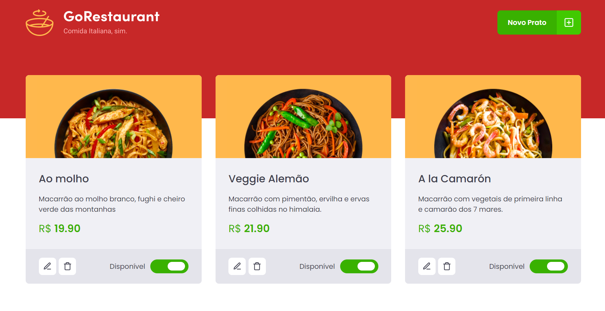

  <h1>:rocket: GoRestaurant  </h1>
  <h2>Complementary Challenge Ignite React Track</h2>
  
Complementary challenge proposed in the React track of Rocketseat's Ignite. In this challenge, we were asked to convert the entire project to TypeScript.

  
It was not possible to deploy this project due to the need to use the FakeAPI with JSON Server.

## Proposed Activities

- [x] Convert the entire project to TypeScript.

## Extras

- [x] Fake API with JSON Server

<h3>Main Screen</h3>

The application consists of only one screen, where you can add new dishes to the menu, edit them, remove them, or select whether they are available or not.

## Giving feedback

Feedback is always welcome, if you have any suggestions or questions please send me an email: gcgonzalez99@hotmail.com
